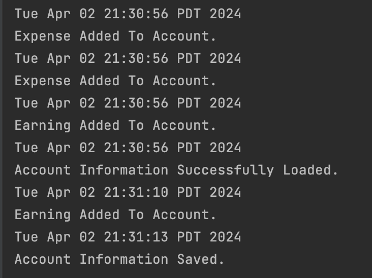

# Personal Finance Tracker
___
## Background
___

The purpose of this application is to provide users a **tool to track their earnings and expenses** so they have a **clear 
overview of their financial situation**. This will increase financial awareness and allow the user to make informed decisions 
about their finances. This application can be used by *anyone* who wants to manage their personal finances.

This application will allow users to log and see all their expenses and earnings. Expenses will be flagged by a category
such as "groceries". This will allow the user to see their total spending per category.

*Why?*

This project was of interest to me because as a university student, I tend to struggle with managing my personal 
finances. There are a lot of untracked expenses that make me unnecessarily overspend in categories such as shopping or entertainment. 
With this application, I hope to make the process of finding where you're overspending more transparent.
___
## User Stories:
___

- As a user, I want to be able to make an account that records all my expenses and earnings
- As a user, I want to be able to add an expense or earning to my account
- As a user, I want to be able to view my list of expenses or earnings separately
- As a user, I want to be able to specify a name, longer description, budget category, amount, and date of an expense being added to my account
- As a user, I want to be able to see my total spending per expense category
- As a user, I want to be able to see my total account balance
- As a user, when I select quit from the menu, I want to be reminded to save the current state of my personal finance tracker to file and have the option to do so or not.
- As a user, when I start the application, I want to be given the option to load my personal finance tracker from file.

---
Instructions for Grader:
---
To add an item, click the "Add New Expense" or "Add New Earning" button.
- You can generate the first required action related to the user story "adding multiple Xs to a Y" by clicking column names in the table to reorder the logged items in ascending/descending order.
- You can generate the second required action related to the user story "adding multiple Xs to a Y" by either clicking on the "Filter Expenses" or "Filter Earnings" button to see the filtering of logged items (bottom of screen).
- You can locate my visual component by looking at the top right hand side labelled "Spending By Category". It has image icons of each of my five categories.
- You can save the state of my application by clicking on the Quit button then the "Yes" button in the window that pops up.
- You can reload the state of my application by selecting the "Yes" button in the first pop-up window that appears upon opening the application.

---
Phase 4: Task 2
---

---
Phase 4: Task 3
---
Looking at my UML diagram, it is evident that there is a lot of coupling present in my application. This will make it difficult to implement new changes into the application in the future. Additionally, my GuiPersonalFinanceTracker class contains code that might be confusing to read and not very cohesive. To fix this issue, if I had more time to work on this project, I would choose more descriptive method names and try to implement the one role design principle so this class has one clear purpose and is not all over the place. Another way I would refactor my code is by making an abstract class for my pop-up windows (SavePopUpWindow, ExpensePopUpWindow, and EarningPopUpWindow) since they all have similarities between them that can potentially be abstracted for clearer and less error-prone code. Some of these similarities include their implements/extends relationships, associations, and their functionality.

---
Resources Used:
---
- How to get and validate format of user input: https://www.youtube.com/watch?v=bI7kQq9cjmQ
- Parsing dates: https://docs.oracle.com/javase/tutorial/datetime/iso/format.html
- How to format console output into columns: https://stackoverflow.com/questions/26576909/how-to-format-string-output-so-that-columns-are-evenly-centered
- Understanding how writing to a JSON file works: https://www.youtube.com/watch?v=-qEpxIARKxE
- How to use Swing Graphics: https://www.youtube.com/watch?v=Kmgo00avvEw&t=1466s

